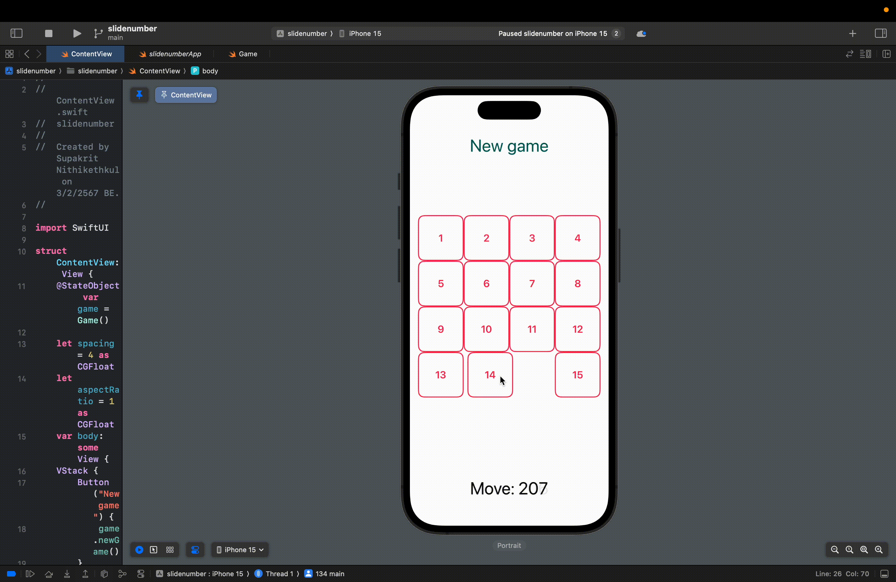
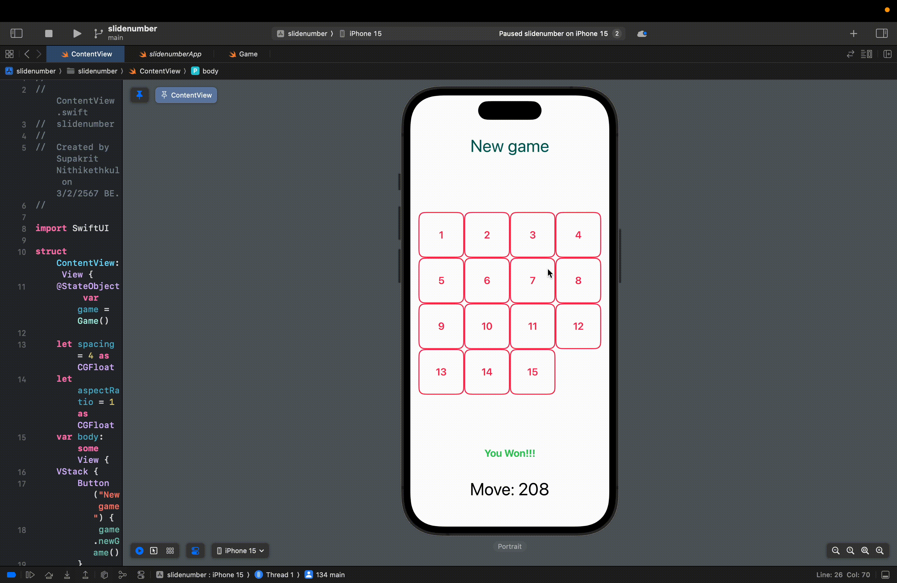

# cn436-as1

### Developer
Student ID
``` Student ID
6410615139
```
Name(English)
``` Name(English)
Supakrit Nithikethkul
```
Name(Thai)
``` Name(Thai)
ศุภกฤต นิธิเกตุกุล
```

### Function
##### Requirements
สร้างiOS App: Slide Number Puzzleขนาด4 x 4ดังรูปซ้ายโดยเกมจะจบลงเมื่อผู้เล่นเลื่อนแผ่นตัวเลขจนเรียงกันจาก1ถึง15ดังรูปขวา
- จํานวนMovesจะเพิ่มที่ละหนึ่งทุกครั้งที่มีการเลื่อนแผ่นตัวเลข
- ให้เพิ่มanimationและสามารถปรับแต่งการแสดงผลต่างจากตัวอย่างได้

##### Optional
- สามารถใช้ได้ทั้งแนวตั้งและแนวนอน

### GIF
> animation การเคลื่อนย้ายตัวเลข และจํานวนครั้งที่ผูัเล่นเคลื่อนย้ายตัวเลข
>> 
> ผลลัพธ์เมื่อชนะ
>> 
> เริ่มเล่นใหม่
>> 
> Orientation Varients
>> 

### Video demo
__[Video demo](https://drive.google.com/file/d/123o5YaTd5Sslqz1_Qnx-bqyKcJ4NQ-aj/view?usp=share_link)__ - google drive link